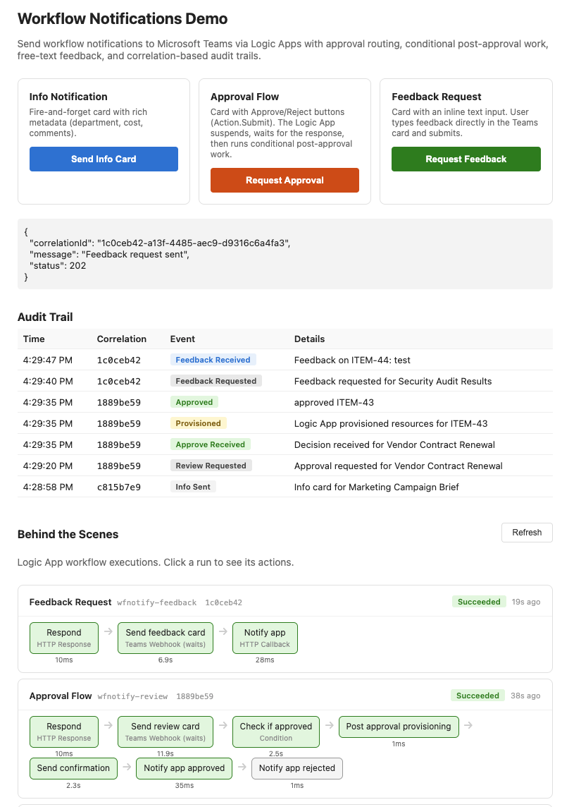
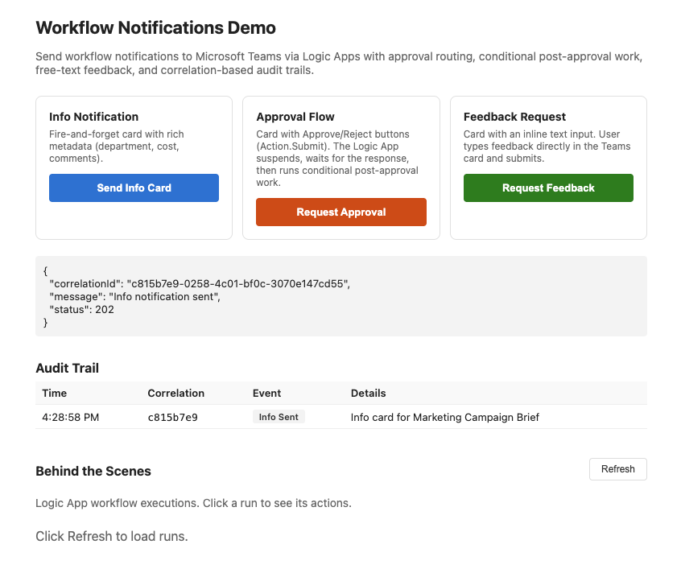
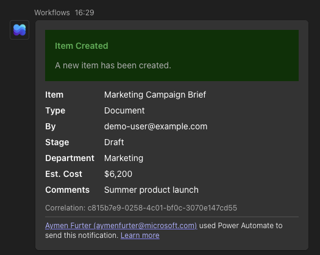
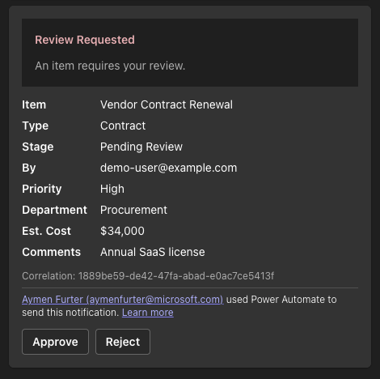
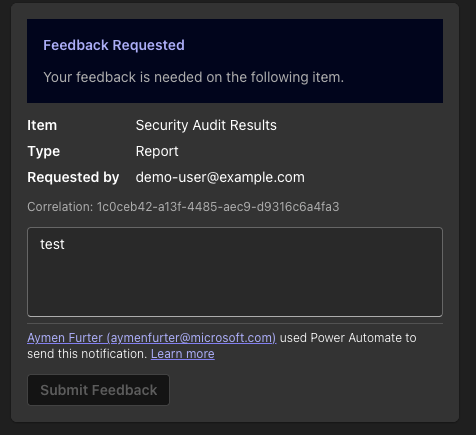
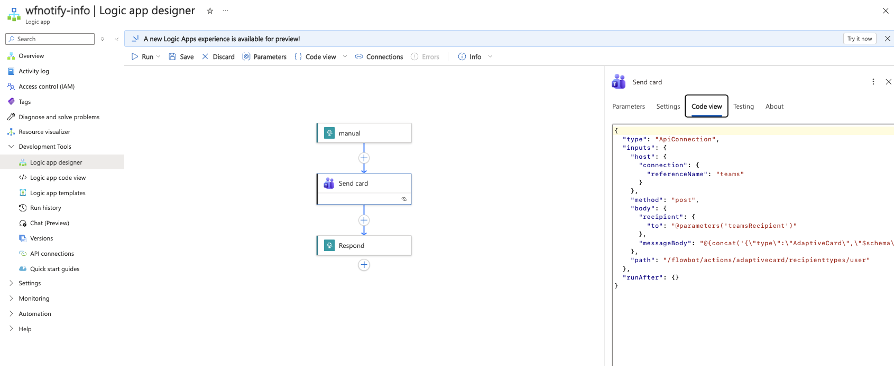

# Workflow Notifications Demo

Send workflow lifecycle notifications to Microsoft Teams using Azure Logic Apps and Adaptive Cards. Supports fire-and-forget info cards, approval flows with conditional post-processing, and free-text feedback collection -- all triggered from an Azure Container App with a correlation-based audit trail.





## Scenarios

| # | Scenario | Pattern | Card actions |
|---|----------|---------|-------------|
| 1 | Info notification | Fire-and-forget (`ApiConnection`) | Read-only |
| 2 | Approval with post-processing | Webhook wait (`ApiConnectionWebhook`) | Approve / Reject (`Action.Submit`) |
| 3 | Feedback collection | Webhook wait (`ApiConnectionWebhook`) | Inline text input + Submit (`Action.Submit`) |

### Info notification

Posts a read-only Adaptive Card with item metadata (department, cost, comments). The Logic App returns immediately after posting.



### Approval with post-processing

Posts a card with Approve/Reject buttons. The Logic App suspends (dehydrates) and waits up to 7 days for the user to respond. On resume:

- **Approved:** runs a post-approval provisioning step, sends a follow-up "Provisioning Complete" card to Teams, then calls `POST /callback/review` on the Container App.
- **Rejected:** calls `POST /callback/review` directly.



### Feedback collection

Posts a card with an inline `Input.Text` field and a Submit button. The Logic App waits for the user to type and submit, then calls `POST /callback/feedback` with the text.



## Logic App definitions

All three Logic Apps are defined in [infra/main.bicep](infra/main.bicep). Below are simplified views of each workflow definition showing the action flow and key configuration.

### wfnotify-info

```
Trigger (HTTP)  →  Send_card (ApiConnection)  →  Respond (202)
```

```json
{
  "triggers": {
    "manual": { "type": "Request", "kind": "Http", "correlation": { "clientTrackingId": "@triggerBody()?['correlationId']" } }
  },
  "actions": {
    "Send_card": {
      "type": "ApiConnection",
      "inputs": {
        "method": "post",
        "path": "/flowbot/actions/adaptivecard/recipienttypes/user",
        "body": {
          "recipient": { "to": "@parameters('teamsRecipient')" },
          "messageBody": "<Adaptive Card with Item, Type, By, Stage, Department, Est. Cost, Comments, Correlation>"
        }
      }
    },
    "Respond": { "type": "Response", "inputs": { "statusCode": 202, "body": { "status": "sent" } }, "runAfter": { "Send_card": ["Succeeded"] } }
  }
}
```

Fire-and-forget: the trigger returns 202 as soon as the card is posted. No wait, no callback.

### wfnotify-review

```
Trigger (HTTP)  →  Respond (202)
                →  Send_review_card (ApiConnectionWebhook, waits up to 7 days)
                    →  Check_if_approved (Condition)
                        ├─ True:  Post_approval_provisioning (Compose)
                        │         →  Send_confirmation (ApiConnection)
                        │         →  Notify_app_approved (HTTP POST /callback/review)
                        └─ False: Notify_app_rejected (HTTP POST /callback/review)
```

```json
{
  "triggers": {
    "manual": { "type": "Request", "kind": "Http", "correlation": { "clientTrackingId": "@triggerBody()?['correlationId']" } }
  },
  "actions": {
    "Respond": { "type": "Response", "inputs": { "statusCode": 202 }, "runAfter": {} },
    "Send_review_card": {
      "type": "ApiConnectionWebhook",
      "inputs": {
        "path": "/flowbot/actions/flowcontinuation/recipienttypes/user",
        "body": {
          "body": {
            "recipient": { "to": "@parameters('teamsRecipient')" },
            "messageBody": "<Adaptive Card with facts + Action.Submit Approve/Reject buttons>",
            "shouldUpdateCard": true,
            "updateMessage": "Your decision has been recorded. Thank you!"
          }
        }
      },
      "limit": { "timeout": "P7D" },
      "runAfter": { "Respond": ["Succeeded"] }
    },
    "Check_if_approved": {
      "type": "If",
      "expression": { "and": [{ "equals": ["@body('Send_review_card')?['data']?['action']", "approve"] }] },
      "actions": {
        "Post_approval_provisioning": { "type": "Compose", "inputs": { "step": "post-approval-provisioning", "note": "Resources provisioned after approval (simulated)" } },
        "Send_confirmation": { "type": "ApiConnection", "inputs": { "path": "/flowbot/actions/adaptivecard/recipienttypes/user", "body": "<Provisioning Complete card>" } },
        "Notify_app_approved": { "type": "Http", "inputs": { "method": "POST", "uri": "@{concat(parameters('callbackHost'), '/callback/review')}", "body": { "action": "approve", "provisioned": true } } }
      },
      "else": {
        "actions": {
          "Notify_app_rejected": { "type": "Http", "inputs": { "method": "POST", "uri": "@{concat(parameters('callbackHost'), '/callback/review')}", "body": { "action": "reject", "provisioned": false } } }
        }
      },
      "runAfter": { "Send_review_card": ["Succeeded"] }
    }
  }
}
```

The `Respond` action returns 202 immediately so the caller doesn't block. `Send_review_card` runs in parallel (both have `runAfter: {}` / `runAfter: { Respond }`), posting a webhook card that suspends the run until the user clicks Approve or Reject. The conditional branch then either provisions + confirms + callbacks, or just callbacks with the rejection.

### wfnotify-feedback

```
Trigger (HTTP)  →  Respond (202)
                →  Send_feedback_card (ApiConnectionWebhook, waits for text input)
                    →  Notify_app (HTTP POST /callback/feedback)
```

```json
{
  "triggers": {
    "manual": { "type": "Request", "kind": "Http", "correlation": { "clientTrackingId": "@triggerBody()?['correlationId']" } }
  },
  "actions": {
    "Respond": { "type": "Response", "inputs": { "statusCode": 202 }, "runAfter": {} },
    "Send_feedback_card": {
      "type": "ApiConnectionWebhook",
      "inputs": {
        "path": "/flowbot/actions/flowcontinuation/recipienttypes/user",
        "body": {
          "body": {
            "recipient": { "to": "@parameters('teamsRecipient')" },
            "messageBody": "<Adaptive Card with facts + Input.Text + Action.Submit>",
            "shouldUpdateCard": true,
            "updateMessage": "Thank you! Your feedback has been submitted."
          }
        }
      },
      "runAfter": { "Respond": ["Succeeded"] }
    },
    "Notify_app": {
      "type": "Http",
      "inputs": {
        "method": "POST",
        "uri": "@{concat(parameters('callbackHost'), '/callback/feedback')}",
        "body": {
          "feedback": "@body('Send_feedback_card')?['data']?['feedback']",
          "correlationId": "@triggerBody()?['correlationId']"
        }
      },
      "runAfter": { "Send_feedback_card": ["Succeeded"] }
    }
  }
}
```

Same pattern as review but simpler: no conditional branch. The card has an `Input.Text` field; the user's text comes back in `body('Send_feedback_card')?['data']?['feedback']` and gets forwarded to the Container App.

## Architecture

| Resource | Name | Purpose |
|----------|------|---------|
| Container App | `wfnotify-app` | Web UI, trigger endpoints, callback endpoints, audit trail |
| Logic App | `wfnotify-info` | Posts info cards (fire-and-forget) |
| Logic App | `wfnotify-review` | Approval card with webhook wait, conditional post-approval work, callback |
| Logic App | `wfnotify-feedback` | Feedback card with webhook wait, callback |
| API Connection | `wfnotify-teams` | Shared Teams connector (manual authorization required once) |
| Container Registry | `wfnotifyacr` | Hosts the Container App image |

### Request flow

1. User clicks a scenario button in the web UI.
2. The Container App generates a `correlationId`, logs it, and POSTs to the Logic App with `x-ms-client-tracking-id`.
3. The Logic App posts an Adaptive Card to Teams.
4. For webhook-wait scenarios (approval, feedback), the Logic App suspends until the user responds in Teams.
5. On response, the Logic App resumes, runs any post-processing, and calls back to the Container App.
6. The Container App records the callback in the audit trail.

### Correlation

Every request gets a UUID v4 `correlationId` that flows through the entire chain: Container App trigger, Logic App run (`clientTrackingId`), Adaptive Card text, callback payload, and audit trail. Queryable in Log Analytics via `customDimensions.correlation.clientTrackingId`.

### Behind the Scenes

The web UI includes a "Behind the Scenes" panel that queries the Azure Management API to show Logic App run history with per-action timing. Uses the Container App's managed identity with Reader role on the resource group.



## Webhook wait pattern

The approval and feedback scenarios use `ApiConnectionWebhook` ("Post adaptive card and wait for a response") instead of the regular `ApiConnection` used by the info scenario. This section explains how it works in detail.

### The problem it solves

You want to send a Teams card and wait for the user to click a button or submit text, but you don't want to keep the Logic App running (and burning compute) while the human thinks.

### Step-by-step lifecycle

1. **Logic App run starts** -- the HTTP trigger fires, `Respond` returns 202 immediately so the caller (the Container App) is not blocked.

2. **The webhook action executes** (`Send_review_card` / `Send_feedback_card`). It does two things atomically:
   - Posts the Adaptive Card to the user in Teams.
   - Registers a callback URL with the Teams connector ("when this card gets a response, call me back at this URL").

3. **Logic App dehydrates** -- the runtime serializes the entire run state to storage and shuts down. No VM, no thread, no compute. On Consumption SKU this means zero cost. The run shows status `Waiting` in the portal.

4. **Time passes** -- could be seconds, hours, or days. The user sees the card in Teams with Approve/Reject buttons (review) or an `Input.Text` field (feedback).

5. **User clicks Submit in Teams** -- Teams sends the `Action.Submit` data (`{"action":"approve"}` or `{"feedback":"some text"}`) to the Teams connector service.

6. **Teams connector calls the callback URL** -- this rehydrates the Logic App run. The runtime loads the serialized state from storage and resumes execution right where it left off, at the action after the webhook action.

7. **The response data is available** via `body('Send_review_card')?['data']`. For review: `?['data']?['action']` gives `"approve"` or `"reject"`. For feedback: `?['data']?['feedback']` gives the typed text.

8. **Remaining actions run** -- the conditional branch, HTTP callbacks to the Container App, etc.

### ApiConnection vs ApiConnectionWebhook

| | `ApiConnection` (info card) | `ApiConnectionWebhook` (review/feedback) |
|---|---|---|
| API path | `/flowbot/actions/adaptivecard/...` | `/flowbot/actions/flowcontinuation/...` |
| Blocks the run? | No -- returns immediately | Yes -- suspends until the user responds |
| Card actions | None (read-only) | `Action.Submit` buttons or text inputs |
| `shouldUpdateCard` | N/A | Replaces the card after submit to prevent double-click |
| `limit.timeout` | N/A | e.g. `P7D` -- auto-fail if no response in 7 days |

### Key properties

- **`limit.timeout`**: ISO 8601 duration (e.g. `P7D`). Without this, runs wait up to the Logic App maximum (90 days for Consumption). On timeout the action gets `ActionTimedOut`.
- **`shouldUpdateCard`** / **`updateMessage`**: Tells Teams to replace the card content with a confirmation message after the user submits, so they cannot submit a second time.
- **Cost while waiting**: zero on Consumption (pay-per-execution only), base hosting cost continues on Standard.

### The body.body nesting

The double `body` nesting in the Bicep definition is not a typo. The outer `body` is the HTTP request body sent to the connector. The inner `body` is the Teams-specific payload containing `recipient`, `messageBody`, `shouldUpdateCard`, and `updateMessage`. The connector API expects this structure.

### Why Respond runs before the webhook action

Look at the `runAfter` configuration: `Respond` has `runAfter: {}` (runs immediately) and `Send_review_card` has `runAfter: { Respond: ["Succeeded"] }`. This means the 202 goes back to the caller first, then the webhook card posts. Without this, the caller would hang until the human responds -- potentially days.

### The callbackHost circular dependency

The review and feedback Logic Apps need to call back to the Container App after the user responds, but the Container App needs the Logic App trigger URLs as environment variables. Neither can be created first. The workaround is a two-phase deploy: `main.bicep` creates everything with a placeholder `callbackHost`, then `update-callback.bicep` redeploys the two Logic Apps with the real Container App FQDN.

## SKU notes

This demo uses Consumption (multitenant). Dehydrated webhook actions cost nothing until the callback arrives. Standard (single-tenant) requires a Workflow Service Plan with fixed compute cost, but adds VNet integration and deployment slots. Standard stateless workflows do not support `ApiConnectionWebhook` -- use stateful.

See: [Consumption vs. Standard comparison](https://learn.microsoft.com/azure/logic-apps/single-tenant-overview-compare), [Logic Apps pricing](https://azure.microsoft.com/pricing/details/logic-apps/)

## Prerequisites

- Azure CLI with Bicep extension
- A Teams-enabled user account for receiving cards

## Deploy

```bash
./deploy.sh your-email@example.com
```

The script creates the resource group, builds the container image, deploys all infrastructure via Bicep, and prints the app URL. After deployment, authorize the Teams API connection through the portal link shown in the output.

## Resources

- Resource group: `rg-workflow-notifications`
- Region: `westeurope`

## Cleanup

```bash
az group delete --name rg-workflow-notifications --yes --no-wait
```
