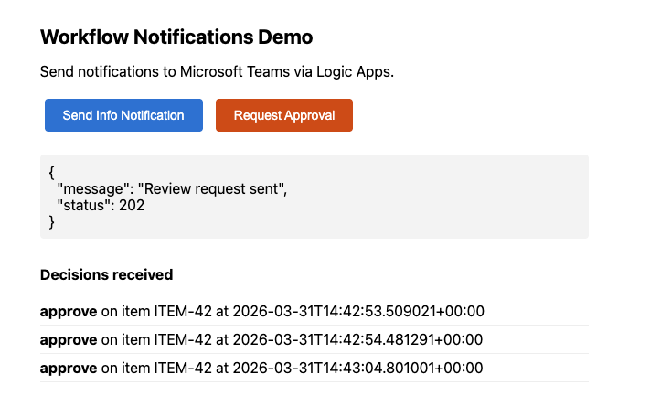

# Workflow Notifications Demo

Minimal end-to-end example showing how to send workflow lifecycle notifications to Microsoft Teams using Azure Logic Apps and Adaptive Cards, with approval callbacks handled by an Azure Container App.

## Screenshots

| Info Card | Approval Card |
|-----------|---------------|
|  |  |

| Web UI | Logic App Designer |
|--------|-------------------|
|  |  |

## Architecture

| Resource | Name | Purpose |
|----------|------|---------|
| Container App | `wfnotify-app` | Web UI to trigger notifications, `/callback` endpoint for approval decisions |
| Logic App | `wfnotify-info` | Posts informational cards to Teams (fire-and-forget) |
| Logic App | `wfnotify-review` | Posts approval cards with Approve/Reject buttons linking back to the Container App |
| API Connection | `wfnotify-teams` | Shared Teams connector (requires one-time manual authorization) |
| Container Registry | `wfnotifyacr` | Hosts the Container App image |

### Flow

1. User clicks **Send Info Notification** or **Request Approval** in the web UI
2. The Container App POSTs to the corresponding Logic App HTTP trigger
3. The Logic App posts an Adaptive Card to Teams via the Teams connector
4. Info cards are read-only. Approval cards have **Approve** / **Reject** buttons (`Action.OpenUrl`) pointing to the Container App's `/callback` endpoint
5. Clicking a button opens a browser tab, the Container App records the decision
6. The web UI polls `/decisions` and displays received decisions

## Prerequisites

- Azure CLI with Bicep
- A Teams-enabled user account for receiving cards

## Deploy

```bash
./deploy.sh your-email@example.com
```

After deployment, authorize the Teams connection via the portal link printed in the output, then open the App URL.

## Resources deployed

- **Resource group**: `rg-workflow-notifications`
- **Region**: `westeurope`

## Cleanup

```bash
az group delete --name rg-workflow-notifications --yes --no-wait
```
